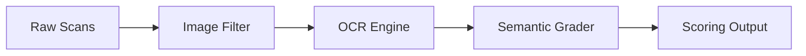
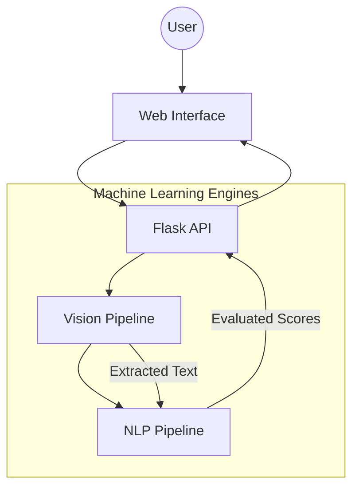

# GradeIQ: Smart Automated Grading

GradeIQ is a computer vision and natural language processing application designed to automate the grading of handwritten student assessments. It scans physical answer sheets, reads the handwriting, and assigns grades by comparing student responses against a reference key.

### The Core Problem It Solves

Manual grading is time-consuming and tedious. GradeIQ accelerates this process by handling the initial evaluation. Unlike basic keyword-matching tools, GradeIQ evaluates the meaning of an answer. If a student explains a concept correctly using different phrasing than the answer key, the system can still recognize the correct logic and award points.

---

### How It Works

The process is designed to be straightforward:

1. **Upload**: Provide a ZIP file containing images or scans of student answer sheets.
2. **Pre-process**: The system cleans the images, removing shadows and adjusting contrast to isolate the handwriting.
3. **Extract Text**: The vision engine identifies text blocks and converts the handwriting into digital text.
4. **Evaluate Logic**: The grading engine compares the extracted text against your reference answer. It checks for semantic similarity (meaning) and logical consistency (ensuring there are no direct contradictions).
5. **Review Results**: The system outputs a detailed report with suggested scores, which can be exported as a CSV.

---

### Technical Architecture

For developers and technical users, GradeIQ relies on a modular pipeline.

#### The Data Flow



#### System Components



---

### Technology Stack

The application is built using established machine learning models and web frameworks:

*   **Backend Application**: Python, Flask
*   **Document Processing**: OpenCV, Pillow, Pillow-Heif
*   **Optical Character Recognition (OCR)**: Microsoft TrOCR and DocTR
*   **Natural Language Processing (NLP)**: DeBERTa-v3 and LaBSE via Sentence-Transformers
*   **Frontend Interface**: HTML, CSS, and Vanilla JavaScript

---

+## Setup and Configuration
+
+### Local Installation
+1.  **Clone the repository**: Download the code to your local machine.
+2.  **Environment Setup**: Create a `.env` file based on `.env.example` and add your `NGROK_TOKEN`.
+3.  **Install Dependencies**: Run `pip install -r requirements.txt`.
+4.  **Run the App**: Start the server using `python app.py`.
+
+### Customization Options
+You can adjust the system behavior via the `.env` file:
+*   **Grading Strictness**: Modify similarity thresholds for scoring.
+*   **Image Processing**: Adjust contrast and shadow-removal intensity.
+*   **Model Selection**: Change the HuggingFace model IDs for OCR or NLP.
+
+---
+
+## How to run in Google Colab
+
+Google Colab is recommended for its free GPU access, which significantly speeds up the OCR and grading process.
+
+1.  **Zip the project**: Compress your local `rmfinal` folder into a file named `rmfinal.zip`.
+2.  **Upload**: Open a new [Google Colab](https://colab.research.google.com/) notebook, click the **Folder icon** on the left, and drag `rmfinal.zip` into the file explorer.
+3.  **Execute the following code**:
+    ```python
+    %cd /content
+    !unzip "rmfinal.zip" && rm "rmfinal.zip"
+    %cd rmfinal
+    !python file.py
+    ```
+4.  **Access the UI**: Once the models load, the output will show a **Public URL** (provided via ngrok). Click that link to open the GradeIQ dashboard.
+
+> [!IMPORTANT]
+> **Cold Start**: The first grading request will trigger a download of several GBs of model data (TrOCR, DeBERTa, LaBSE). This can take 2-5 minutes depending on internet speed. Subsequent grading will be instant.
+
+> [!TIP]
+> For best performance, go to **Runtime > Change runtime type** and select **T4 GPU**.