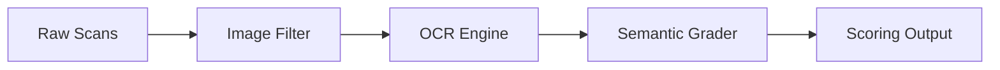
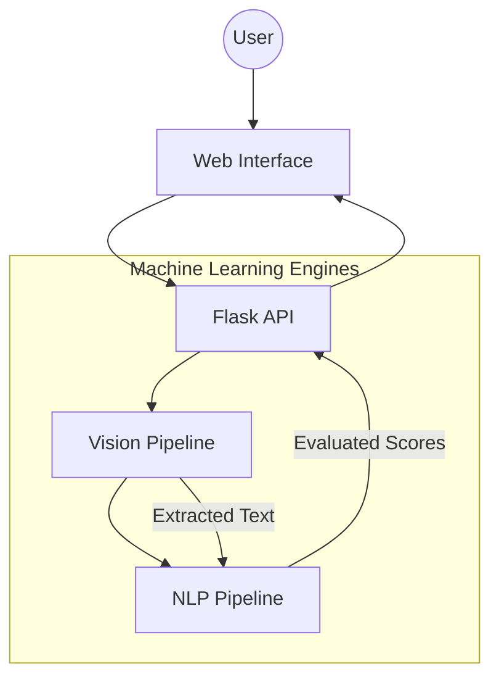

# GradeIQ: Smart Automated Grading

GradeIQ is a computer vision and natural language processing application designed to automate the grading of handwritten student assessments. It scans physical answer sheets, reads the handwriting, and assigns grades by comparing student responses against a reference key.

### The Core Problem It Solves

Manual grading is time-consuming and tedious. GradeIQ accelerates this process by handling the initial evaluation. Unlike basic keyword-matching tools, GradeIQ evaluates the meaning of an answer. If a student explains a concept correctly using different phrasing than the answer key, the system can still recognize the correct logic and award points.

---

### How It Works

The process is designed to be straightforward:

1. **Upload**: Provide a ZIP file containing images or scans of student answer sheets.
2. **Pre-process**: The system cleans the images, removing shadows and adjusting contrast to isolate the handwriting.
3. **Extract Text**: The vision engine identifies text blocks and converts the handwriting into digital text.
4. **Evaluate Logic**: The grading engine compares the extracted text against your reference answer. It checks for semantic similarity (meaning) and logical consistency (ensuring there are no direct contradictions).
5. **Review Results**: The system outputs a detailed report with suggested scores, which can be exported as a CSV.

---

### Technical Architecture

For developers and technical users, GradeIQ relies on a modular pipeline.

#### The Data Flow

#### System Components

---

### Technology Stack

The application is built using established machine learning models and web frameworks:

*   **Backend Application**: Python, Flask
*   **Document Processing**: OpenCV, Pillow, Pillow-Heif
*   **Optical Character Recognition (OCR)**: Microsoft TrOCR and DocTR
*   **Natural Language Processing (NLP)**: DeBERTa-v3 and LaBSE via Sentence-Transformers
*   **Frontend Interface**: HTML, CSS, and Vanilla JavaScript

---

### Setup and Configuration

GradeIQ is designed to be highly customizable. You do not need to modify the code to adjust its behavior; all primary settings are managed via an environment file.

**Installation**
1. Clone the repository to your local machine.
2. Install the necessary Python packages listed in the requirements file.
3. Create a `.env` file in the root directory to store your configuration.

**Customization Options**
The `.env` file allows you to adjust the system to your specific needs:
*   **Grading Strictness**: Modify the confidence thresholds required for the system to mark an answer as correct, partially correct, or incorrect.
*   **Image Processing**: Adjust the intensity of the shadow-removal and contrast filters to match the quality of your specific scanner or camera.
*   **Model Selection**: Switch between different HuggingFace models for both OCR and NLP tasks if you require specialized performance.

**Running the Application**
Start the application by running the main Python script. Once the server initializes, you can access the user interface through your web browser to begin processing assessments.
